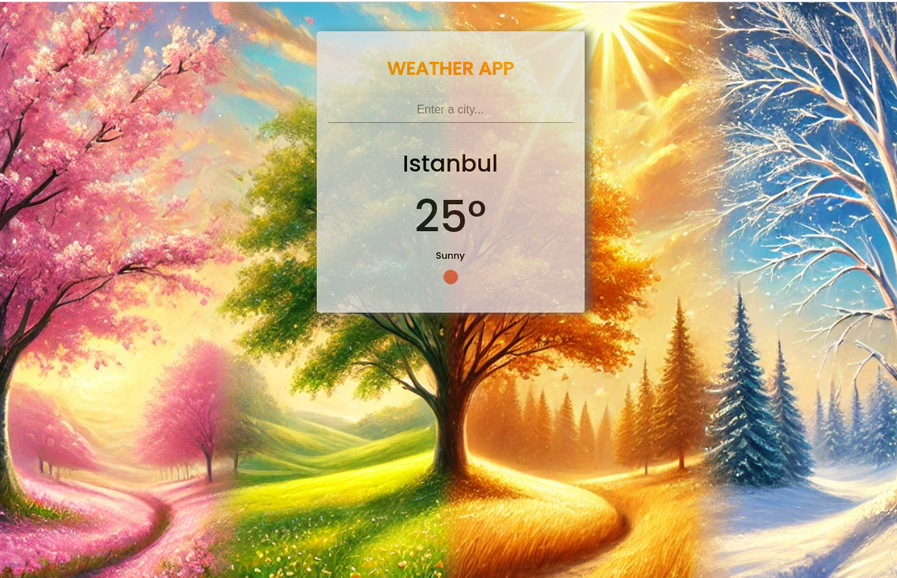

# Weather App

This Weather App allows users to search for the current weather of any city. The app fetches real-time weather data using the OpenWeatherMap API and displays the city's temperature, weather condition, and an icon representing the current weather.

---

## **Demo**
You can view a live demo of the application here: [Weather App Demo](https://your-demo-url.com)



---

## **Features**
- Search for any city's current weather.
- Displays the temperature in Celsius.
- Shows a weather icon and description (e.g., "Sunny", "Cloudy").
- Responsive design suitable for different screen sizes.

---

## **Installation and Usage**

### **1. Clone the repository**
```bash
git clone https://github.com/your-username/weather-app.git
```

### **2. Navigate to the project directory**
```bash
cd weather-app
```

### **3. Install dependencies**
```bash
npm install
```

### **4. Add your OpenWeatherMap API key**
- Create a `.env` file in the root directory.
- Add the following line to the `.env` file:
```env
API_KEY=your_api_key_here
```

### **5. Run the application**
Open the `index.html` file in your browser:
```bash
xdg-open index.html
```

---

## **Technologies Used**
- HTML, CSS, and JavaScript for the frontend.
- OpenWeatherMap API for weather data.

---

## **File Structure**
```
WeatherApp/
├── bg1.png
├── bg2.png
├── bg3.png
├── bg4.png
├── bg5.png
├── bg6.png
├── index.html
├── main.js
├── package-lock.json
├── README.md
├── style.css
└── weatherAPI.js
```

---

## **Screenshots**
### **Home Screen**


---

## **License**
This project is licensed under the MIT License. Feel free to use and modify it as needed.

